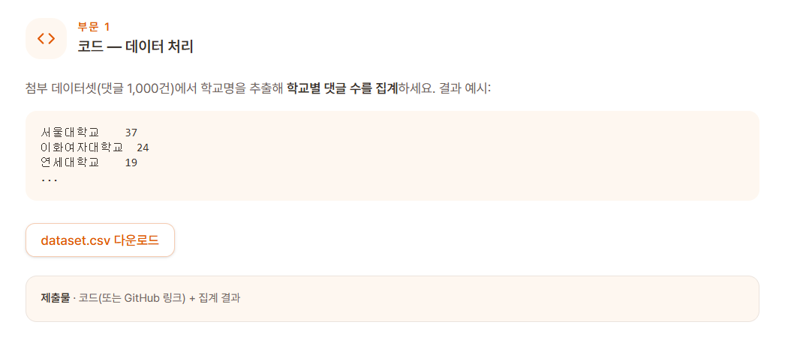
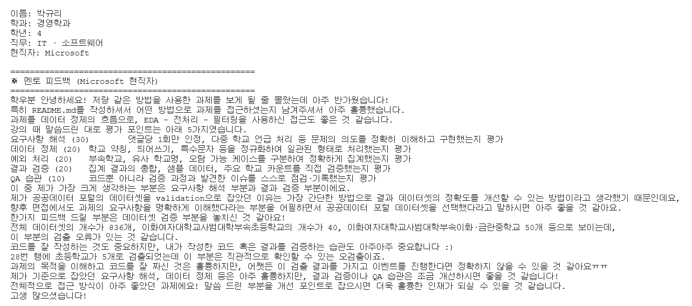

## 1. 과제 내용

## 2. 파이프라인

### 0. GT(정답) 사전 데이터 준비 — `notebooks/0.0-build-school-dict.ipynb`, `notebooks/0.1-build-abbreviations.ipynb`

- `build_school_dict.ipynb`: 공공데이터포털의 초중고(`High_Middle_Elementary.csv`,
  10,470개) + 대학교(`University.csv`, 1,969개) 명단을 정리해
  `data/processed/gt_schoolnames.csv`로 저장.
- `build_abbreviations.ipynb`: 하드코딩 (약어 규칙으로 넣을려고 했지만 실패)
  `gt_schoolnames.csv`에 `약어`(수동 예외,한 번 채우면 덮어쓰지 않음) 컬럼을 추가.

### 1. EDA — `notebooks/1.0-eda.ipynb`
`data/raw/dataset.csv`(1,000건) 확인.
- 결측치는 없고, 
- `comment` 완전 중복이 173개 고유 문구(최대 6회 반복)로 발견됨 — 친구에게 문구를 그대로 공유해 신청한 경우로 보여 오류로 판단하지 않음.
- 여러 학교명이 나온 경우는 하나의 학교만 뽑아야함 ("뽑아주세요"와 같은 말을 통해 해당 데이터는 이벤트 추첨을 위한 데이터 모음이라 판단) 
- 학교명이 문장 속에 자연어로 섞여 있고 "건국대→건대" 같은 축약형이 존재한다는 걸 확인해, "초/중/고/대/학교 접미사로 판별"하는 방향을 정함.

### 2.1 전처리 1단계 — `clean_text` (`src/data/preprocessing.py`)
이모지, `ㅋㅋ`/`ㅎㅎ`/`ㅠㅠ`류 자음·모음만 연속되는 구간, 문장부호(`. , ! ? ~ … /`)를
제거하고 공백을 정리 → `comment_clean_1`.

### 2.2 전처리 2단계 — `clean_pos` (`src/data/preprocessing.py`)

- 명사 추출하다가 오류 발생 -> 조사만 삭제하는걸로 변경

어절(공백 기준 단어) 단위로 Okt 형태소 분석을 돌려서,
- `Josa`(조사)로 태깅된 토큰은 무조건 버리는 게 아니라 `_recover_from_josa`를 거침 — 알려진
  조사 접미사(은/는/이/가/에서/으로 등)로 끝나면 그 부분만 잘라내고 앞부분(예: "건국대**로**"
  → "건국대")은 살림. 순수 조사면 빈 문자열. ( 여기에서 ~대로 이게 조사로 보였었지)

전처리 1·2단계 결과를 `data/interim/preprocessing.csv`에
`comment_id, comment, comment_clean_1, comment_noun`로 저장 (`notebooks/2.0-preprocessing.ipynb`).

### 3.0 학교명 후보 추출 — `notebooks/3.0-extract-candidates.ipynb`

**1차 필터**: `comment_noun`에서 "학교/초/중/고/대" 접미사로 끝나는 토큰만 뽑아
`school_candidate`로 만듦 (`extract_school_candidates`). 이 시점에 댓글당 후보 개수 분포:

| 후보 개수 | 댓글 수 |
|---|---|
| 0 | 109 |
| 1 | 790 |
| 2 | 83 |
| 3 | 18 |

**2차 필터 — 후보 0건 폴백**: 109개 행을 두 단계 폴백으로 복구.

1. **원문 재매칭**: Okt가 학교명을 조사로 잘못 태깅해 통째로 지워버린 경우(예: "서울고"의
   "고"가 `Josa`로 태깅됨, `_JOSA_SUFFIXES` 목록에 "고"가 없어서 그냥 버려짐), 형태소 분석
   이전 원문(`comment_clean_1`)에서 어절 단위로 직접 접미사 매칭 재시도
   (`extract_school_candidates_fallback`). 109건 → 3건으로 감소.
2. **띄어쓴 음절 병합**: "서 강 대"처럼 한 글자씩 띄어 쓴 나머지 3건은 연속된 한 글자
   토큰을 합친 뒤(`merge_spaced_syllables`) 같은 폴백을 한 번 더 적용. 0건 완전 해소.

최종 결과를 `data/interim/school_candidate_counts.csv`에
`comment_id, comment, comment_clean_1, comment_noun, school_candidate, school_candidate_count`로
저장.

### 3.1 후보 정규화 — `notebooks/3.1-normalize-candidates.ipynb`

`school_candidate`의 각 토큰을 GT와 비교 가능한 정식 명칭 형태로 통일해 `preprocessed_candidate`
컬럼을 만듦 (`preprocess_candidate`). 아직 GT에 실제로 존재하는지는 확인하지 않고, 표기만 맞춘다.

1. GT의 `약어` 컬럼(공백으로 여러 개 있을 수 있음, 예: "이대")에 있으면 → 그 행의 정식명
   ("이화여자대학교")으로 치환
2. 아니면 접미사 확장 (`expand_school_suffix`): "초"/"고" → "등학교", "중" → "학교",
   "대" → "학교"(대학교). 이미 "학교"로 끝나면 그대로 둠

예: "서강대"→"서강대학교", "서초중"→"서초중학교", "인하대부속초"(약어 사전에 없으면)
→"인하대부속초등학교"(접미사만 기계적으로 확장, 실존 여부는 다음 단계에서 확인).
GT에 실제로 없는 것("먹고"→"먹고등학교")도 이 단계에서는 그냥 통과시킨다.

결과를 `data/interim/preprocessed_school_candidate.csv`에 저장.

### 4.0 GT 대조 — `notebooks/4.0-gt-match.ipynb`

`preprocessed_candidate`의 각 토큰이 `gt_schoolnames.csv`의 정식명 목록에 실제로 있는지만
확인 (`gt_match`). 이 시점 매칭 개수(`gt_match_count`) 분포:

| 매칭 개수 | 댓글 수 |
|---|---|
| 0 | 162 |
| 1 | 789 |
| 2 | 49 |

**0건(미매칭) 162개 행 원인 분석**: `preprocessed_candidate`를 토큰 단위로 펼쳐서 빈도를 보니
고유 미매칭 토큰이 16종류뿐이었고, 그중 다수가 **부속학교 축약형**
(`인하대부속초등학교`, `인하부초등학교`, `인하대학교부속중학교`, `이화여자대학교부속고등학교` 등)
이었음. 정식 명칭이 "인하대학교사범대학부속중학교"처럼 불규칙해서 접미사 확장 규칙으로는
못 뽑히는 케이스.

- **수동 별칭 보강**: `0.1-build-abbreviations.ipynb`의 `MANUAL_ALIASES`에 부속학교 별칭
  5건 추가 후 재매칭
- **표기 오류 보정** (`TOKEN_FIXES`): 실제 학교명인데 접미사 확장이 살짝 어긋난 것만 수동 보정
  (`서초등학교`→`서초초등학교`, `인하대부속초등학교`→`인하대학교부속초등학교`)
- **순수 오검출 제거** (`JUNK_TOKENS`): 접미사만 남아 특정 학교를 가리키지 않는 토큰만 버림
  (`학교`, `고등학교`, `중학교`, `초등학교`, `최고등학교`). GT 매칭 여부와 상관없이 이 집합에
  없으면 학교명으로 인정해 `ans`에 채택

보강 후 0건(진짜 미매칭)이 162 → 16으로 줄었고, 최종 정답 컬럼 `ans`/`ans_count`를
`data/interim/gt_match_results.csv`에 저장 (`comment_id, comment, comment_noun, school_candidate,
preprocessed_candidate, school_candidate_count, gt_match, gt_match_count, ans, ans_count`).

> **발견 & 수정한 버그**: 이 노트북에 같은 파일을 저장하는 셀이 두 번 있었는데, 나중 셀이
> `ans`/`ans_count` 컬럼 없이 다시 덮어써서 위 보강 결과가 최종 파일에 반영이 안 되고 있었음.
> 중복 저장 셀을 제거하고, 다음 단계(`5.0-aggregate.ipynb`)가 `gt_match`가 아니라 `ans`를
> 집계하도록 같이 고쳐서 재실행함.

### 5.0 최종 집계 — `notebooks/5.0-aggregate.ipynb`

`ans` 컬럼(댓글당 매칭된 정식 학교명, 여러 개면 공백 구분)을 펼쳐서 학교별 댓글 수 집계.
한 댓글에 학교가 2개 이상 언급된 경우(`ans_count >= 2`, 49건), 시간 관계상 어느 쪽이 진짜
정답인지 판단하는 로직은 만들지 못해서 **둘 다 그대로 카운트** — 그래서 집계 총합(1,033)이
1,000건보다 큼. 이건 알려진 한계점.

> EDA에서 "뽑아주세요" 같은 문구로 미뤄볼 때 이 데이터는 추첨용이라 댓글당 학교 1개가
> 정답에 가깝다고 판단했었음 (2번 섹션 참고) — 그렇다면 이 "둘 다 카운트"는 임시방편이고,
> 추후엔 복수 언급 시 어느 쪽을 정답으로 볼지 규칙이 필요함.

상위 학교 (일부):

| 학교명 | count |
|---|---|
| 인하대학교사범대학부속중학교 | 51 |
| 이화여자대학교사범대학부속이화·금란중학교 | 50 |
| 인하대학교 | 44 |
| 서초초등학교 | 43 |
| 서초중학교 | 42 |
| 잠원초등학교 | 42 |

결과를 `results/school_counts_2026-08-01/school_counts.csv`에 저장.

**남은 한계점**:
- 위에서 설명한 복수 학교 언급 중복 카운트 (총합 > 1,000)
- 진짜 미매칭 16건은 여전히 `ans`가 빈 값 (학교명이 아예 없거나 GT에 없는 신규/오탈자 케이스)
- `초등학교`라는 특정 학교를 가리키지 않는 토큰이 5건 집계에 섞여 있음 — GT 사전(`gt_schoolnames.csv`)
  자체에 이런 값이 정식명으로 들어있는 것으로 보이는 데이터 품질 이슈로, 아직 정리 안 됨

## 3. 피드백

## 4. 제출 이후 (`notebooks/4.1-gt-match.ipynb`)
- 남아있는 ans 0건 16건 처리: 대괄호 제거 + 띄어쓴 음절 병합(`merge_spaced_syllables`) 재적용으로 해소. "최고"(→최고등학교) 같은 오검출은 기존 JUNK_TOKENS가 그대로 걸러줌
- 2건 이상(49건) 처리: 문장 뒤쪽에 언급된 학교가 진짜 신청 학교라는 규칙을 직접 확인. `ans` 순서가 원문 등장 순서와 달라서, 각 축약형을 `comment_clean_1`에서 `rfind`로 재검색해 실제 마지막 등장 위치 기준으로 재정렬 후 채택
- GT 사전 자체 데이터 품질 문제 추가 발견: "초등학교"라는 특정 학교를 안 가리키는 값이 `gt_schoolnames.csv`에 정식명으로 들어있었음 → `is_structurally_valid_school_name`(학교명은 항상 `[2글자 이상 고유명사]+[학교급 접미사]` 형태라는 규칙)으로 검증해 5건 발견 후 재처리
- 위 과정에서 `extract_school_candidates_fallback`(가장 짧은 접미사 매칭)의 한계 발견: "서초중"→"서초", "이대부초"→"이대"처럼 짧은 접미사가 먼저 걸려 뒤 글자를 놓치는 경우가 있어서, 가장 긴 접미사 매칭 버전(`extract_school_candidates_longest`)을 별도 추가 (기존 함수는 3.0 파이프라인용이라 안 건드림)
- 노트북마다 복붙되던 `find_repo_root`/`preprocess_candidate`/`gt_match` 등을 `src/utils/utils.py`로 분리 (`src/data` → `src/utils`로 폴더명도 변경)

**한계점 (에러/플래그 없이 조용히 틀릴 수 있는 것들)**:
- `ans_count==2`의 "맨 뒤 언급이 진짜 학교" 규칙은 49건 관찰로 귀납한 것이지 검증된 규칙은 아님 — 화자 학교가 먼저 나오는 등 다른 문장 패턴이면 틀릴 수 있음
- `"보고"`만 정확히 문자열 매칭으로 제거하는데, 데이터가 늘어나면 "가고"/"먹고"류 다른 동사 활용형도 같은 식으로 섞여 나올 수 있고 지금은 안 걸러짐
- `apply_token_fixes`가 "JUNK_TOKENS만 아니면 채택"하는 설계라, GT에 문자 그대로 존재하는지 검증 안 된 값도 `ans`로 들어감 (예: "대치초등학교"는 GT 원본이 "서울대치초등학교"라 완전일치 안 함에도 채택)
- 같은 이유로 "서울공고"(축약형, GT 미매칭 → `"서울공고등학교"`로 그대로 채택)와 "서울공업고"(GT 정식명 매칭 → `"서울공업고등학교"`)가 같은 학교인데 표기가 갈려서 최종 집계에서 안 합쳐짐(각 17건). `TOKEN_FIXES`에 `"서울공고등학교"→"서울공업고등학교"` 추가하면 해결되지만 아직 반영 안 함
- `ans_count >= 3`인 경우 처리 로직이 없음 — 지금 데이터는 우연히 0/1/2건만 나왔지만, 데이터가 늘어나면 3개 이상 매칭되는 행이 생길 수 있고 그러면 그대로 다 카운트돼서 5.0 집계가 중복됨
- `extract_school_candidates_longest`도 이론적으로 완전한 규칙이 아니라 지금까지 나온 사례로만 검증된 경험적 규칙
- 동명이인 학교 문제: 같은 이름의 학교가 여러 지역에 있을 수 있는데 축약형만으론 지역 구분 불가능
- GT 사전 데이터 품질 문제는 "초등학교" 1건만 확인했지 전수 검증한 건 아님

## 5. 배운점 
- 항상 확인하는 습관 (마지막에 확인 안해서 "초등학교" 같은 결과 나왔지)
- 데이터 전처리 같은 경우 왔다갔다가 심하니까 애초에 utils.py를 만들어서 함수는 걍 다 거기에 저장해두고 필요할때마다 꺼내 쓰는 형식이 편하다. 즉 함수 가져와서 쓰는 형식으로 앞으로 할 것 
- 현재는 notebooks로 되어있지만 이게 사실상 src 역할을 한다는것 ( 처음부터 파일 정리 제대로 할 것 )
- result 나오면 검증하는 double check항상 만들어야한다는것
- 원본 데이터(공공데이터)도 100% 못 믿는다는 것 — GT 사전 자체에 "초등학교"라는 실제 학교명이 아닌 오류 데이터가 이미 들어있었음. 내 파이프라인 버그가 아니라 소스 데이터 품질 문제였고, GT 사전 만드는 단계에서부터 구조적 검증(접두 어절 길이 등)을 했어야 함
- 예외처리를 특정 subset에서만 하면 같은 문제가 다른 경로로 새어 들어올 수 있다는 것 — JUNK_TOKENS 필터가 gt_match_count==0인 행에만 적용되다 보니, GT 사전에 우연히 매칭된 "초등학교"는 그 필터를 아예 안 거치고 최종 결과까지 새어 들어갔음. 예외처리는 특정 조건의 subset이 아니라 전체 데이터에 일반 규칙으로 적용하는 게 안전
- "커널이 이어지지 않으니 다시 짜야 한다"는 이유를 재계산이 필요한 것(df, alias_to_canonical)과 그냥 고정값이라 재계산이 필요 없는 것(TOKEN_FIXES, JUNK_TOKENS)에 구분 없이 적용해서, 상수까지 노트북마다 복붙했다는 것 — 이런 건 utils.py에 한 번만 정의하고 가져다 쓸 것
- 중간 결과 csv를 계속 덮어쓰다 보니 롤백이 안 돼서 결국 파일명에 숫자 붙여가며 임시 백업했다는 것 — 다음부턴 확정된 단계마다 git commit으로 스냅샷을 남기거나, 수정 로직을 mutate 대신 새 df를 반환하는 순수 함수로 짜서 특정 단계를 껐다 켰다 할 수 있게 만들 것
- 계속 일을 반복한 이유 : gt 검증 안해서 
  => 무조건 gt도 검증한다. 데이터 어떻게 나왔는지 확인하고 이상한 애들 없는지 이상치 확인하는 습관 (초등학교만 나온건 이상한 케이스니까 이걸 확인할 수 있는)
- 뭔가 같은걸 계속 반복한 느낌이 들어서 이거 어떻게 고칠지 고민해봐야함 좀 더 효율적인 frmaework가 있을거라고 생각... 
  => 이상치 탐지했을때 다른 경우가 다른 열에 있는지 같이 다 확인하는 습관 가져야함 
- fin_ans ans 처럼 뭔가 바뀌어도 그 전걸로 롤백하기 쉽게 저장의 저장을 해줘야하는데 이거 어떻게 할지 고민
  => 매번 copy.()이용해서 진행할 것 그리고 나서 진짜 fin이 되면 그때 df에 저장할 것 (저장을 덮어쓰기 형태로 )